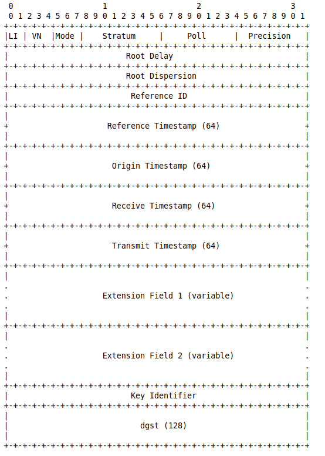

## Лабораторная №2 - NTP Сервер

### Сборка

Для сборки необходим .NET Core v3.10+. По команде `dotnet run` программа будет запущена без создания исполняемого файла.  
Для полной сборки проекта команда `dotnet build`.

### Запуск

Необходим запускать с правами администратора, так как 123 порт находится в зарезервированных системой.

### Ntp Сервер

Сервер реализует протокол NTPv3. Со следующей структурой протокола

Сервер тестировался с помощью пакета ntpd.