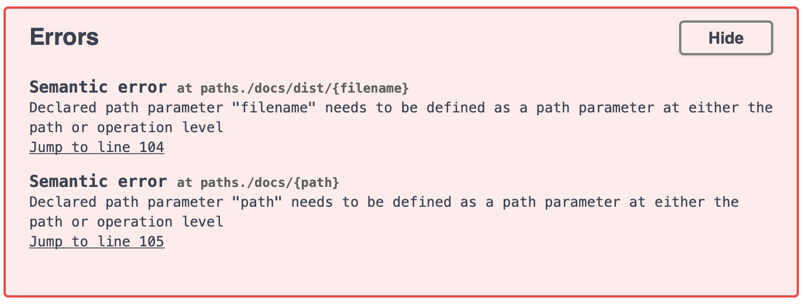

# Лабораторная работа №4: OpenAPI

Задание:
--------------------------------------
В данной работе требуется создать описание REST API для вашего варианта сервера из предыдущего задания. То есть
используя всё то же задание создать новый протокол и его описание (json или yaml файл, соответствующий OpenAPI
specification).

Описание можно как создать в ручную, так и породить из кода сервера.

Не обязательным требование является имплантация клиента и сервера для данного протокола.


Резлуьтат можно увидеть по пути: /swagger либо загрузить файл docs.yaml в SWAGGER EDDITOR
===================================================

```
В случае, если хочется сгенерировать отчет через сервис, необходимо выполнить действия, описанные в ЗАПУСК.
Стоит отметить, что ручки не работают, так как не было цели сделать полноценную имлпементацию сервиса.
Основной задачей было посмотреть как генерируется очет и какой механизм описания ручек.
```

При загрузке yaml файла через swagger editor, будет следующая ошибка, связанная с автогенерацией отчета:


Запуск
--------------------------------------

Для запуска необходимо скачать Python 3.x (рекомендовано 3.8 )

При первом запуске необходимо ввести команду для загрузки зависимостей:

```
python3 -m pip install -r requirements.txt
```

Затем можно вводить команду для запуска клиента:

```
python3 -m src.app 
```
