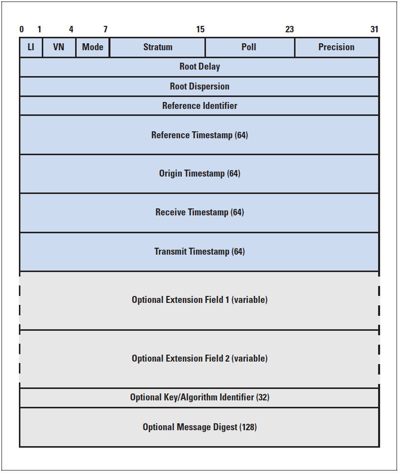
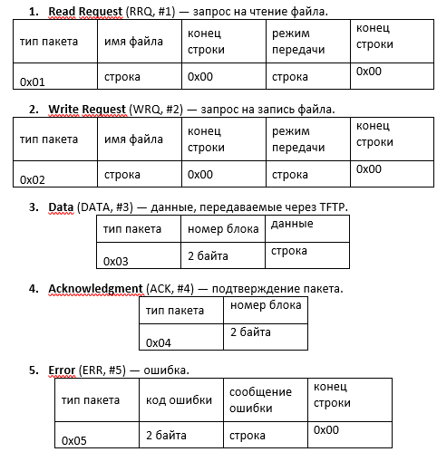

# Лабораторная работа № 2
Работа выполнена на языке Kotlin (версия Kotlin 1.4.20, версия Java 15.0.1).
Сборка производится с помощью Gradle (версия 6.5.1)

## NTP-сервер
### Сборка
Сборка всех jar-файлов (для обоих вариантов):
```
gradle all
```
Сборка NTP-сервера:

```
gradle ntp-server
```

### Запуск
```
java -jar ntp-server.jar options_list
```

Параметры:
```
    --address, -a [localhost] -> хост { String }
    --port, -p [123] -> порт { Int }
    --reference, -r [PPS] -> id источника { String }
    --stratum, -s [2] -> слой { Int }
```

### Протокол


### Тестирование
Для тестирования использовалась [данная реализация NTP-клиента](http://support.ntp.org/bin/view/Support/JavaSntpClient).

## TFTP-клиент
### Сборка
Сборка всех jar-файлов (для обоих вариантов):
```
gradle all
```
Сборка TFTP-клиента:

```
gradle tftp-client
```

### Запуск

```
java -jar tftp-client.jar options_list
```

Параметры:
```
    --address, -a [localhost] -> хост { String }
    --port, -p [69] -> порт { Int }
```

### Протокол


### Тестирование
Для тестирования использовалась [данная реализация TFTP-сервера](http://commons.apache.org/proper/commons-net/xref-test/org/apache/commons/net/tftp/TFTPServer.html).